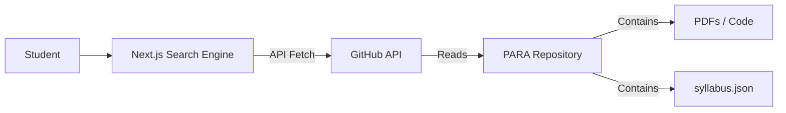

# System Architecture

PARA is designed as a **Headless Content Management System**. It separates the "Data Layer" (this repository) from the "Application Layer" (the search engine).

## 1. High-Level Design



## 2. The Data Layer (GitHub)
The repository acts as the database.

Folder Hierarchy: Acts as the categorization schema (`Semester > Course`).

Content: Static files (PDF, JPG, C++, PY).

Metadata: JSON files that provide context to the static files.

### The `syllabus.json` Schema
Every course directory must contain a `syllabus.json` file. This is the "Brain" that allows the search engine to filter content intelligently.

Structure:

```json

{
  "courseId": "CIS-101",
  "courseName": "Introduction to Computing",
  "lastUpdated": "2026-01-03",
  "resources": [
    {
      "filename": "lecture-05-pointers.pdf",
      "type": "lecture",
      "exclusions": [
        {
          "pages": "10-15",
          "reason": "Advanced pointer arithmetic removed from 2026 syllabus"
        }
      ]
    }
  ]
}
```

### The Application Layer (Next.js)
Planned for Phase 3. The frontend application will:

Query the GitHub Repository contents.

Parse the `syllabus.json` for the requested course.

Display a list of "Active" topics.

Offer a "Download Bundle" button: This triggers a server-side process to zip all relevant files (excluding files marked as deprecated) for the student.